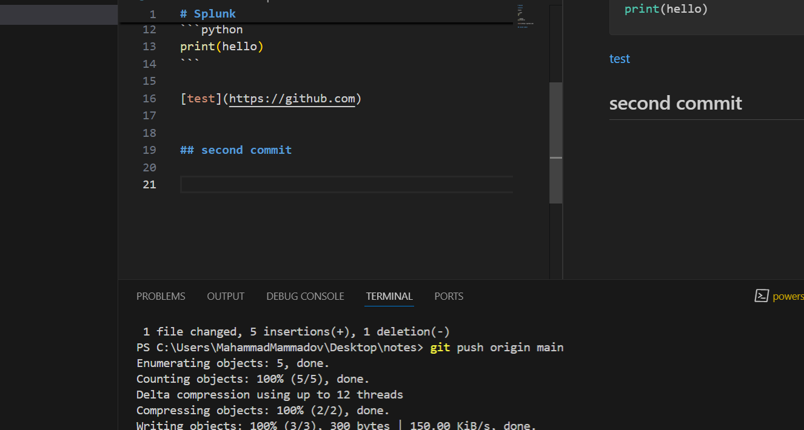
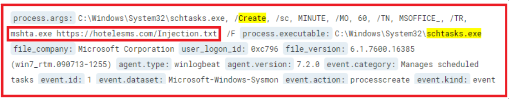

# ELK queries

## A hunt for well-known PowerShell Offensive Frameworks and commands

```
winlog.event_data.ScriptBlockText:(PowerUp OR Mimikatz OR NinjaCopy OR Get-ModifiablePath OR AllChecks OR AmsiBypass OR PsUACme OR Invoke-DLLInjection OR Invoke-ReflectivePEInjection OR Invoke-Shellcode OR Get-GPPPassword OR Get-Keystrokes OR Get-TimedScreenshot OR PowerView)
```
<br>

## A hunt for suspicious parent process spawning PowerShell

we'll look into Sysmon's Process creation events, event id 1:

```
winlog.event_data.ParentImage:(*mshta.exe OR *rundll32.exe OR *regsvr32.exe OR *services.exe OR *winword.exe OR *wmiprvse.exe OR *powerpnt.exe OR *excel.exe OR *msaccess.exe OR *mpub.exe OR *visio.exe OR *outlook.exe OR *chrome.exe OR *iexplorer.exe OR *sqlserver.exe) AND winlog.event_data.Image : *powershell.exe
```
<br>

## Perform a hunt for renamed PowerShell.exe

```
winlog.event_data.Description:*PowerShell AND NOT (winlog.event_data.Image:*powershell.exe OR winlog.event_data.Image:*powershell_ise.exe)
```
<br>

## Perform a hunt for base64-encoded PowerShell commands

```
(winlog.event_data.Description:*PowerShell OR  winlog.event_data.Image:*powershell.exe) AND winlog.event_data.CommandLine:*-e*
```
<br>

## Perform a hunt for execution of an assembly from file by PowerShell

```
winlog.event_data.ScriptBlockText:((*Load*) AND (*ReadAllBytes* OR *LoadFile*))
```
<br>

## Perform a hunt for PowerShell commands downloading content

```
winlog.event_data.ScriptBlockText:(*WebClient* OR *DownloadData* OR *DownloadFile* OR *DownloadString* OR *OpenRead* OR *WebRequest* OR *curl* OR *wget* OR *RestMethod* OR *WinHTTP* OR *InternetExplorer.Application* OR *Excel.Application* OR *Word.Application* OR *Msxml2.XMLHTTP* OR *MsXML2.ServerXML* OR *System.XML.XMLDocument* OR *BitsTransfer*)
```
<br>

## Hunt for malicious use of rundll32

```
process.name:rundll32.exe AND (process.args:pcwutl.dll AND process.args:LaunchApplication)
```
<br>

## Hunt for UAC Bypass

filtering for Sysmon's Event ID 7 -- Image loaded.

```
event.id:7 AND (process.name:cliconfg.exe AND file.path:NTWDBLIB.dll)
```
<br>

## Hunt for UAC Bypass #2

```
event.id:13 AND registry_key_path:"shell\\runas\\command\\isolatedCommand"
```
<br>

## Hunt for RDP Settings tampering

```
event.id:1 AND (process.name:netsh.exe AND (process.args:localport=3389 AND process.args:action=allow))
```
<br>

## Hunt for DCSync

```
event.id:4662 AND NOT (user.name:*$ OR user.name:AUTHORITY OR user.name:Window) AND (object.properties:1131f6ad-9c07-11d1-f79f-00c04fc2dcd2 OR object.properties:Replicating)
```
<br>

## Hunt for Remote WMI Usage



```
event.id:4648 AND process.executable:WMIC.exe
```
<br>

## Hunt for LOLBAS openurl

```
process.executable:rundll32.exe AND process.args:(url.dll OR ieframe.dll OR shdocvw.dll)
```
<br>

## Hunt for persistence through scheduled Tasks

The detection is based on Sysmon Event ID 1 - Process Creation.

```
event.id:1 AND ((process.executable:schtasks.exe AND process.args:create) OR process.executable:at.exe)
```

Once the query is executed, we'll get the following match:



<br>

## Perform a hunt for account discovery

- 4798 -- A user's local group membership was enumerated
- 4799 -- A security-enabled local group membership was enumerated

```
winlog.event_id:(4798 OR 4799) AND winlog.event_data.CallerProcessName:(net OR net1)
```
<br>

## Hunt for Persistence through Accessibility Features

Reviewing the information available in T1015, we assemble the following list of targeted executables:

- Sethc.exe

- Utilman.exe

- Osk.exe

- Magnify.exe

- Narrator.exe

- DisplaySwitch.exe

- AtBroker.exe

```
winlog.event_data.Image:("C:\Windows\System32\osk.exe" OR "C:\Windows\System32\sethc.exe" OR "C:\Windows\System32\utilman.exe" OR "C:\Windows\System32\magnify.exe" OR "C:\Windows\System32\narrator.exe" OR "C:\Windows\System32\displayswitch.exe" OR "C:\Windows\System32\atbroker.exe") AND winlog.event_data.Description:"Windows Command Processor" AND winlog.event_data.User:"NT AUTHORITY\SYSTEM"
```
<br>

## Hunt for Privilege Escalation through Scheduled tasks

Reading through the hinted document, we create a list of writable locations by all users, which is suspicious to run tasks from (remember to filter out known-good!). These locations are:

- C:\users\*

- C:\programdata\*

- C:\Windows\Temp\*


```
winlog.event_id:1 AND winlog.event_data.Image:"C:\Windows\system32\schtasks.exe" AND winlog.event_data.CommandLine:("C:\users" OR "C:\programdata" OR "C:\Windows\Temp")
```
```
winlog.event_data.TargetFilename:"C:\Windows\System32\Tasks\elevator"
```
```
winlog.event_id:1 AND winlog.event_data.Image:"C:\Windows\system32\schtasks.exe" AND winlog.event_data.CommandLine:("run" AND "elevator")
```

```
winlog.event_id:1 AND winlog.event_data.ParentImage:"taskeng.exe" AND winlog.event_data.Image:("cmd.exe" OR "wscript.exe" OR "rundll32.exe" OR "cscript.exe" OR "regsrv32.exe" OR "wmic.exe" OR "mshta.exe" OR "powershell.exe")
```

```
winlog.event_id:1 AND winlog.event_data.Image:"C:\Windows\system32\schtasks.exe" AND winlog.event_data.CommandLine:("delete" AND "elevator")
```
<br>

## Hunt for RDP over a Reverse SSH Tunnel

By reviewing the hinted post, to discover this activity, we should be looking at Event ID 4624 (Successful logon) with Logon type 10 (indicating RDP).

```
winlog.event_id:4624 AND winlog.event_data.LogonType:10 AND winlog.event_data.IpAddress:"127.0.0.1" 
```