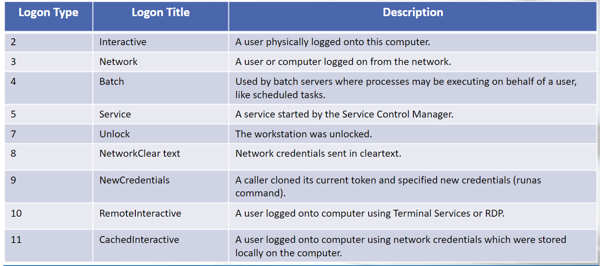
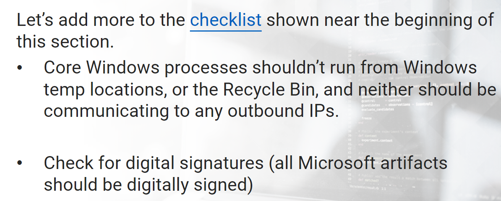
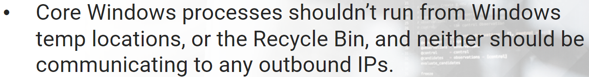
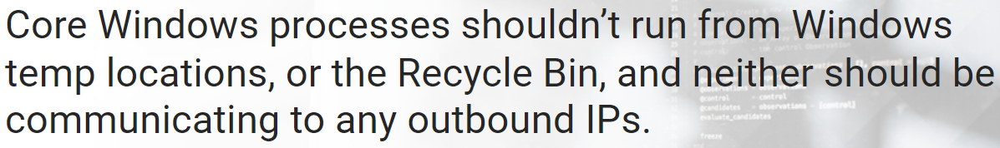
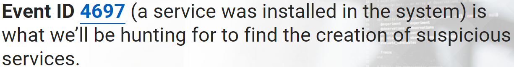
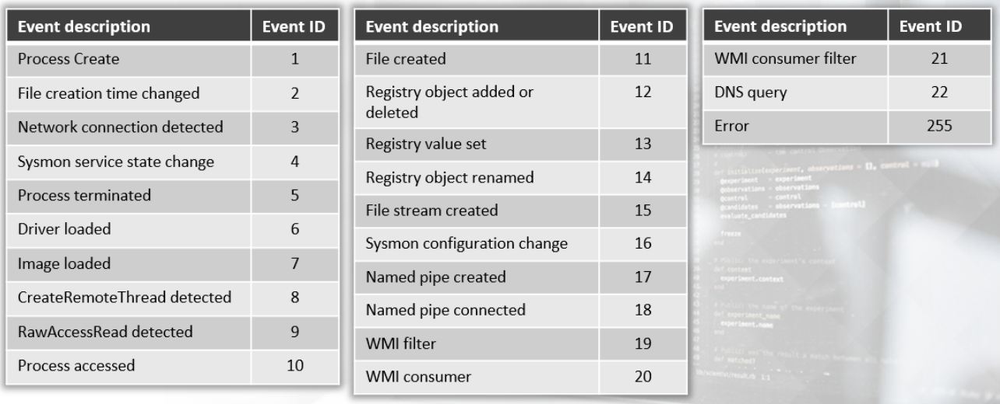
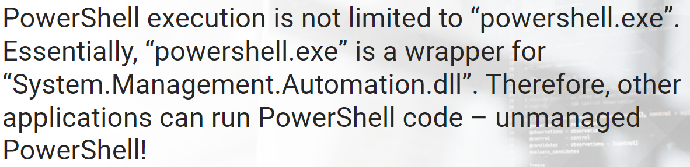
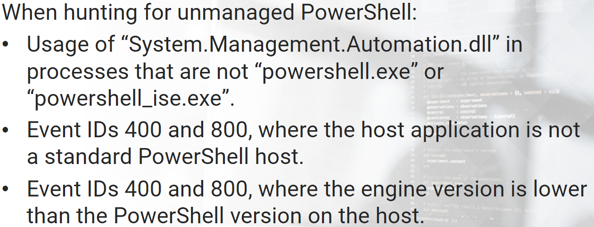

# Windows Event Logs

All versions of Windows maintain 3 core event logs:
- Application
- System
- Security (authentication and security processes)

The EVT format was eliminated for a XML-based format using the EVTX extension.

---

Microsoft added a new category of event logs, called **"Applications and Services"**. These logs are used by individual apps or system components.   

---
# Windows Event IDs
>
>

## Logon Types
>

## Hunting PsExec
>
>

## Hunting WMI Persistence
>

## Hunting Scheduled Tasks
>

## Hunting Service Creations
>

## Hunting Nerwork Shares
>
>

## Hunting Log Clearing
>

# Sysmon events
>

# (Unmanaged) Powershell
>
>
>