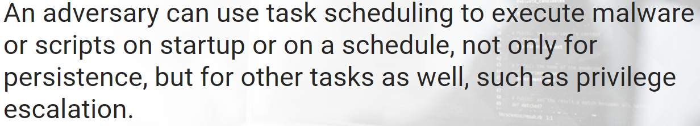

# Malware Persistence

The most common, and the most obvious, registry location is:
> **HKLM\Software\Microsoft\Windows\CurrentVersion\Run**   
**HKCU\Software\Microsoft\Windows\CurrentVersion\Run**  
**HKLM\Software\Microsoft\Windows\CurrentVersion\Policies\Explorer\Run**
**HKCU\Software\Microsoft\Windows\CurrentVersion\Policies\Explorer\Run**   

Some **not so common** locations include:

> **HKLM\Software\Microsoft\Windows NT\CurrentVersion\Winlogon\Userinit**   
**HKLM\Software\Microsoft\Windows NT\CurrentVersion\Image File Execution Options**  
**HKLM\Software\Wow6432Node\Windows NT\CurrentVersion\Image File Execution Options**   

Utilities such as **at.exe** and **schtasks.exe** can be used to schedule execution of malware or scripts based on specific date/time or even an event.

>

An example from ATT&CK for scheduled tasks is from APT3:
> - **schtasks /create /tn "mysc" /tr C:\Users\Public\test.exe \sc ONLOGON \ru "System"**

## Windows Services: Service Creation
A service can be configured to run at boot, which often load before AV software. Services are created using the built-in Windows **"sc"** command.

