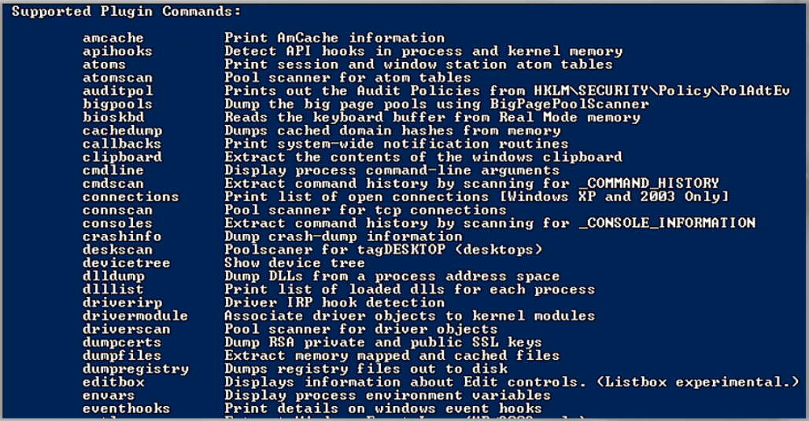
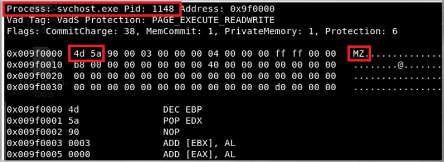

# Volatility



**psscan, psxview** - used to identify hidden processes.   

Injected areas that begin with the "MZ" header are especially interesting to us - denoting a Windows executable file. Of course the injected area may contain shellcode, which lacks the "MZ" header.   


``` 
Partial output of "malfind" - "MZ" header detected.   
```
> 

Volatility has a plugin **"yarascan"** which allows you to search for strings, patterns, and also compound rules.