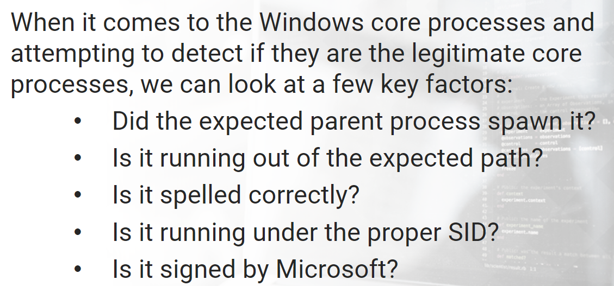
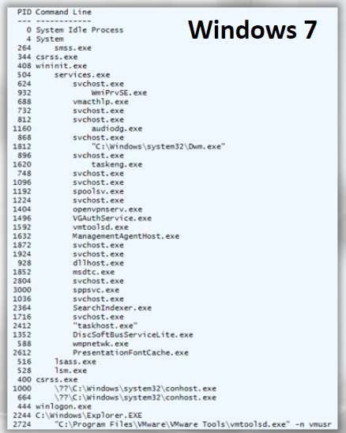
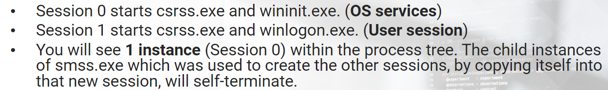
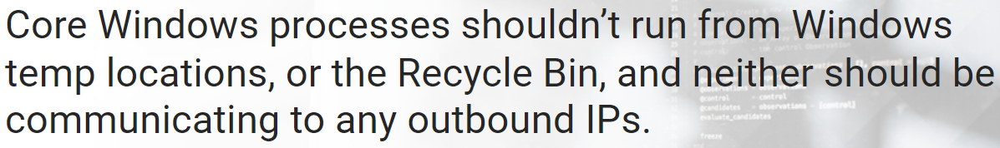

# Windows Processes

>

## **SMSS.EXE**
**smss.exe** is known as the *Session Manager*.

>

## **CSRSS.EXE**
>

## **WINLOGON.EXE**

**winlogon.exe** is responsible for user logon/logoffs.

Malware sometimes abuses the **SHELL** registry value. This value should be explorer.exe.  
Another registry key that is abused by malware that works in conjunction with winlogon.exe is **Userinit**.

## **WININIT.EXE**

**WININIT.EXE** is the *Windows Initialization Process*. It is responsible to launch **services.exe, lsass.exe and lsm.exe** in Session 0.

You should only see **1 instance** of wininit.exe.

## **LSM.EXE**

**lsm.exe** is the *Local Session Manager*. It is responsible to work with smss.exe to create, destroy or manipulate new user sessions.
> Note: After Windows 7, lsm.exe no longer exists, and it is now a service called lsm.dll.

##  **SERVICES.EXE**

**services.exe** is the *Service Control Manager*.     
Parent to **svchost.exe, dllhost.exe, taskhost.exe, spoolsv.exe**, etc.

## **LSASS.EXE** 

**lsass.exe** is the Local Security Authority Subsystem. It is responsible for user authentication and generating security tokens for SAM, AD, and NetLogon. Writes to the **Security event log**.

## **SVCHOST.EXE** 

**svchost.exe** is the *Generic Service Host Process*.  
Each Service will have registry entries that include ServiceDll. This will instruct svchost.exe what DLL to use.   
The entry will also include **svchost.exe -k \<name>**

>it can be used to launch malicious services. When this is done, (-k) will not be present. Another technique used is to place it in different directories, but note that services.exe will not be the parent.

## **TASKHOST.EXE**
**taskhost.exe** is a generic host process which acts as a host for processes that run from DLLs rather than EXEs.  
- In Windows 8, this process was renamed to **taskhostex.exe**.
- In Windows 10, this process was renamed to **taskhostw.exe**.

## **EXPLORER.EXE**
**explorer.exe** is responsible for the user's desktop and everything that comes with it, including access to files(file browser) and launching files via their file extensions.

>**Hunting tip:** They will inject into the process, spawn malware named as explorer.exe, run it from a different folder or misspell it and have it run from the actual folder. Look for instances where explorer has CMD hanging off it or is listening/connected on a network port.    
   

  

 >
 >

