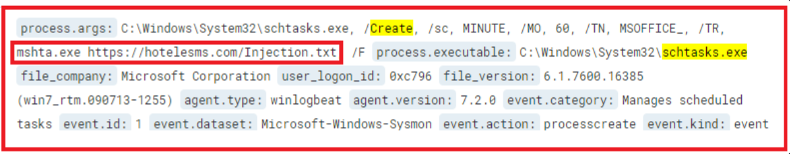
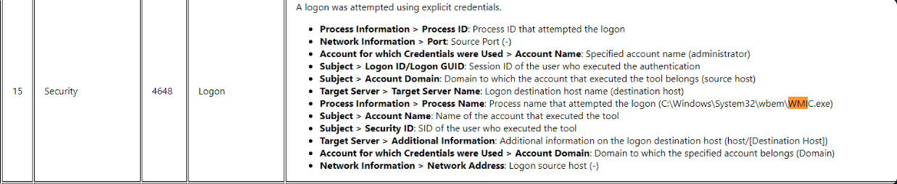
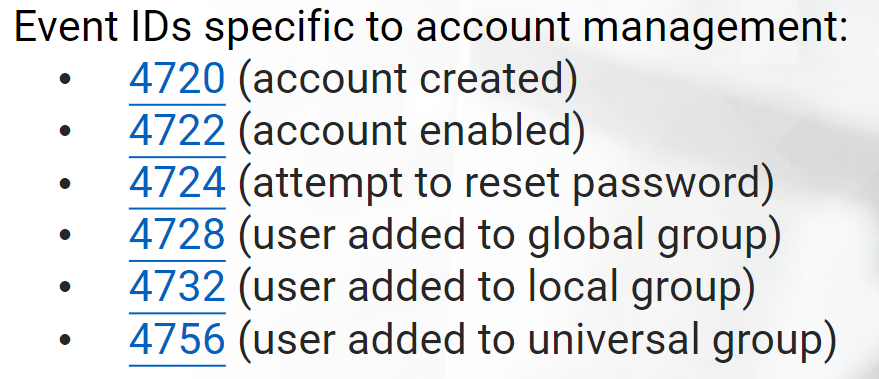

# Windows Processes

## **SMSS.EXE**
**smss.exe** is known as the *Session Manager*.

## **CSRSS.EXE**

## **WINLOGON.EXE**

**winlogon.exe** is responsible for user logon/logoffs.

Malware sometimes abuses the **SHELL** registry value. This value should be explorer.exe.

Another registry key that is abused by malware that works in conjunction with winlogon.exe is **Userinit**

## **WININIT.EXE**

**WININIT.EXE** is the *Windows Initialization Process*. It is responsible to launch **services.exe, lsass.exe and lsm.exe** in Session 0

